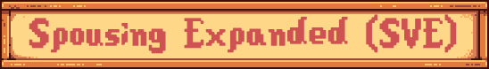  

**Spousing Expanded** is a comprehensive mod for Stardew Valley that enhances the spouse experience within the popular _Stardew Valley Expanded_ (*SVE*) mod.
Designed to deepen your in-game relationships, this mod introduces a wealth of new content for each SVE spouse, bringing them to life like never before.

This mod enhances your experience with your spouse in various ways, such as adding new events in the form of dates, giving your spouse a customized schedule on certain days that act as mini-events, and introducing many more features.

The mod is updated step-by-step to eventually update all *SVE* spouses. With high enough demand and time on hand, it could also be considered to update vanilla spouses as well,
but for now the focus lies on SVE characters exclusively. (The wizard is an exception, as SVE made him romanceable, so he will be included too.)

 

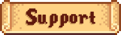  

- 
The mod requires <strong>Stardew Valley Expanded (SVE)</strong>, which is responsible to add the base content.
 
- The mod works in Stardew Valley **version 1.6**
- Translation are currently available in the following languages: **English** 🇬🇧, **German 🇩🇪**.

 

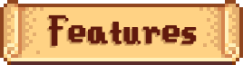  

Here’s a more detailed breakdown of all the features included in this mod:

- **Date Events:** After reaching 14 hearts with your spouse, there's a random chance they’ll ask you out on a date. Sometimes, you’ll even get to choose the type of date you want to have. Once the plans are made, meet your spouse at the specified time and location to start the event. After a date, there’s a cooldown period of at least 20 days before another date can occur.
- **Customized Schedule**: In the vanilla game, an NPC adjusts their schedule once they become your spouse. This mod takes it a step further by making their schedule feel more dynamic, with custom schedules throughout the seasons. These custom schedules introduce unique days that occur only once each year. On these special days, you can interact with your spouse during their unique schedule to unlock specific dialogue and possibly receive a reward if you follow along with their plans.
- **Custom Home Portraits**: When your spouse is at home, they’ll wear different clothes to better match the home environment, rather than always wearing their outdoor attire. The clothing they wear is also dependent on the current season and weather.

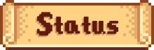  

Below is a list of all the spouses included in Spousing Expanded. This list tracks the progress of the mod's development, indicating which spouses have been fully implemented and which ones are still in progress. The order in which the spouses are listed also reflects the order of their implementation.

Stay tuned for updates as more spouses are completed and added to the mod!

<!--

    

        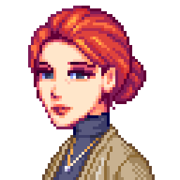
        
Claire 🔨

    

    

        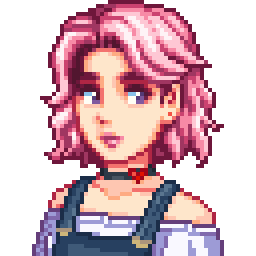
        
Sophia ✗

    

    

        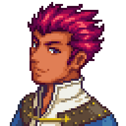
        
Lance ✗

    

    

        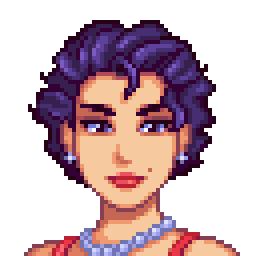
        
Olivia ✗

    

    

        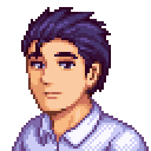
        
Victor ✗

    

    

        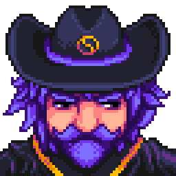
        
Magnus ✗

    

-->

| Character | Status  | Image |
|-----------|---------|-------|
| Claire 🔨 | **WIP**     |  |
| Sophia ✗  | **Planned** |  |
| Lance ✗   | **Planned** |    |
| Olivia ✗  | **Planned** |  |
| Victor ✗  | **Planned** |  |
| Magnus ✗  | **Planned** |  |

 

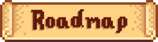  

In addition to the main features that are guaranteed to be implemented, there are some ideas currently under consideration. If these ideas prove feasible and add value to the mod and game, they’ll be included in a future patch:

- *Character Comments*: Other characters may occasionally comment on your relationship with your spouse, acknowledging that you are married.
- *Wedding Day Remembrance*: Your spouse (and possibly other characters) will remember your wedding day and have specific dialogue with you on that day each year.
- *Mail*: A few days after your wedding, you’ll receive congratulations via mail from other characters. You may also randomly receive letters from characters closely related to your spouse, such as Scarlett if you’re married to Sophia.
